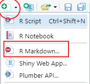

```{r setup, include=FALSE}
options(htmltools.dir.version = FALSE)
knitr::opts_chunk$set(
  fig.retina = 3, # https://community.rstudio.com/t/size-of-image-in-xaringan-slides/21319/12
  collapse = TRUE,
  comment = "#>"
  )

xaringanExtra::use_xaringan_extra(c(
  "tile_view",  # type 'o' to see an overview of the slides
  "clipboard",  # copy-paste of the code chunks
  "panelset",   # panels, https://pkg.garrickadenbuie.com/xaringanExtra/panelset/
  "freezeframe" # so gifs play when we get to the slide
  ))

emoji <- function(x) paste0(emo::ji(x), "&nbsp;")

url_tidyverse_logo <- function(pkg) {
  sprintf("https://raw.githubusercontent.com/tidyverse/%s/master/man/figures/logo.png", pkg)
}
```

class: title-slide, inverse, bottom
background-image: url(`r params$png_background`)
background-size: cover

# `r rmarkdown::metadata$title`
### `r paste0("CFE R Training - Module ", params$module)`

<br/>

`r rmarkdown::metadata$author` and `r rmarkdown::metadata$ta`

---
class: middle

# Useful links

[Slides](`r params$url_slides`), if you want to navigate on your own

[RStudio Project](`r params$url_project`), to try out the exercises

[Teams Space](`r params$url_teams`), for discussions

[Github repository](`r params$url_github`), for later reference

---
class: middle

# Housekeeping matters

`r emoji("woman_raising_hand")` During the session, ask questions in the chat 
or raise your hand

`r emoji("camera")` Sessions are recorded. Remember to turn off your camera if 
its your preference

`r emoji("speech_balloon")` After the session, post follow-up questions, 
comments or reactions in the [Teams space](`r params$url_teams`)

`r emoji("pencil")` If you are going through these slides on your own, type `p` 
to see the presenter notes

???

The presenter notes are where you might also find OECD or CFE specific 
information.

---
class: middle

# Learning objectives for today

1. Understand what RMarkdown is and its many implementations.

1. Understand how Markdown, YAML and R code are used together to make a report.

1. Learn how to leverage the `params` arguments to parametrise reports.


---
class:inverse, bottom, left

# Introduction
## What is RMarkdown?

---
background-image: url(https://github.com/rstudio/rmarkdown/blob/main/man/figures/logo.png?raw=true)
background-position: `r params$background_position`
background-size: `r params$background_size`

# What is RMarkdown?

It is an **authoring framework** for data science, that combines:

- Prose
- Code
- Results

The term _RMarkdown_ can also make reference to:

- `r emoji("document")`  A file format (`.Rmd`)
- `r emoji("package")` The [`rmarkdown`](https://pkgs.rstudio.com/rmarkdown/) package.

---
# The RMarkdown universe

TODO: Add about xaringan, bookdown, blogdown/distill/postcards...

---
# How does the process work?

.pull-left[
### As programmers, we...

1. Create an `.Rmd` file.
1. Write prose and R code
1. Specify rendering parameters
1. *Knit* the document, by clicking on a button

]

.pull-right[

### Behind the scenes...

**rmarkdown** processes the `.Rmd` file using [knitr](https://github.com/yihui/knitr/) and [pandoc](https://pandoc.org/)

.center[]
]


---
class: exercise

# `r emoji("pencil")` Create and knit an `.Rmd`

Let's try these out at the same time in the [RStudio Cloud Project](`r params$url_project`).


1. Create an`.Rmd` from the RStudio IDE.

    ```{r, echo = FALSE, out.width = "20%", fig.align = "center"}
    
    ```

1. *Knit* the document.

    ```{r, echo = FALSE, out.width = "10%", fig.align = "center"}
    
    ```

1. Make some changes, knit again.

---
class:inverse, bottom, left

# Markdown, R and YAML
## (Text, code and metadata)

---

# YAML parameters

.pull-left[
- They are defined at the beginning of `.Rmd` files

- They control the output file format (e.g. PDF, Word, HTML)

- And the different options for each file format
]

.pull-right[

```markdown
*---
*title: "Country note: Korea"
*author: "CFE/EDS"
*date: "`r Sys.Date()`"
*output: 
*  html_document:
*    theme: yeti
*    toc: true
*    toc_float: true
*  word_document: default
*---

## Labour productivity in Korea

Labour productivity is measured as GDP 
per hour worked. In Korea, the most 
productive region...
```

]

---
class: exercise

# `r emoji("pencil")` YAML parameters

```{r, echo = FALSE}
countdown::countdown(minutes = 5, top = 0, id = "yaml")
```

## Instructors demonstrate...

- How to find the different output options for `html_document`
- Knitting an `.Rmd` to different type of outputs

## You do...

In the [RStudio Cloud Project](`r params$url_project`):

- Create a new `.Rmd` file from RStudio
- Choose `html_document` as output option
- Try out different themes and knit
- Add a floating table of contents

---
# Markdown syntax

.panelset[

.panel[.panel-name[Headers]

.pull-left[

```md
# First level
## Second level
### Third level
#### Fourth level
```

].pull-right[

# First level
## Second level
### Third level
#### Fourth level
  
]

]

.panel[.panel-name[Text]

.pull-left[

```md
Another option to ~~crochet~~
_knit_ an `.Rmd` document is 
using the `render()` function
from the __rmarkdown__ package.

But most of the time, the 
easiest way to go about it is 
using the _Knit_ button in 
RStudio, or the keyboard 
shortcut `Ctrl + Shift + K`
```

].pull-right[

Another option to ~~crochet~~
_knit_ an `.Rmd` document is 
using the `render()` function
from the __rmarkdown__ package.
But most of the time, the 
easiest way to go about it is 
using the _Knit_ button in 
RStudio, or the keyboard 
shortcut `Ctrl + Shift + K`
]

]

.panel[.panel-name[Lists]

.pull-left[

```md
- One item
- Another item
  - A sub-item
  - Another sub-item

1. Item 1
1. Item 2
1. Item 3
```

].pull-right[

- One item
- Another item
  - A sub-item
  - Another sub-item

1. Item 1
1. Item 2
1. Item 3

]

<br/>

> `r emoji("bulb")` You are not required to keep the count in numbered lists.
]

.panel[.panel-name[Images]

.pull-left[

```md

```

].pull-right[
.center[

]
]

> `r emoji("raising_hand_woman")` What is the use of the text inside the square brackets?
]

.panel[.panel-name[Links]

.pull-left[

```md
[RStudio's RMarkdown lessons](https://rmarkdown.rstudio.com/lesson-1.html)
```
<br/>

```md
<https://rmarkdown.rstudio.com/lesson-1.html>
```


].pull-right[

[RStudio's RMarkdown lessons](https://rmarkdown.rstudio.com/lesson-1.html)

<br/>

<https://rmarkdown.rstudio.com/lesson-1.html>


]

]

]

???

In the RStudio IDE, you can always go to: Help -> Markdown quick reference for a list of these rules.

---
class: exercise

# `r emoji("pencil")` Markdown syntax

```{r, echo = FALSE}
countdown::countdown(minutes = 5, top = 0, id = "yaml")
```

In the [RStudio Cloud Project](`r params$url_project`):

1. Create a new `.Rmd` using the RStudio IDE, or use a previous one.

1. In the top of the RStudio IDE, go to _Help_ -> _Markdown Quick Reference_.

1. Using the reference, add the following elements to your document:
  - A footnote.
  - A block quote.
  - A table.

---
class: inverse, bottom, left
background-image: url(`r params$png_break`)
background-size: cover

# Break

```{r, echo = FALSE}
countdown::countdown(minutes = 10, top = 0)
```

---
class:inverse, bottom, left

# Parametrised reports

---
# Another simple slide

With text. Let's see the text.

```{r}
summary(iris)
```

---
class: inverse, bottom, left
background-image: url(`r params$png_background`)
background-size: cover

# Annex

---
background-image: url(https://bookdown.org/yihui/rmarkdown/images/cover.png)
background-position: 800px 250px
background-size: 230px

# En otras palablas

Es una herramienta que nos permite convertir un archivo con texto y código en R en varios tipos de:

- Documentos: [HTML](https://bookdown.org/yihui/rmarkdown/html-document.html), [PDF](https://bookdown.org/yihui/rmarkdown/pdf-document.html), [Word](https://bookdown.org/yihui/rmarkdown/word-document.html)
- Presentaciones: [PowerPoint](https://bookdown.org/yihui/rmarkdown/powerpoint-presentation.html), [Beamer](https://bookdown.org/yihui/rmarkdown/beamer-presentation.html)

Y muchos más...

- Documentos con [dashboards o Shiny apps](https://bookdown.org/yihui/rmarkdown/dashboards.html)
- Presentaciones [xaringan](https://bookdown.org/yihui/rmarkdown/xaringan.html)
- [Sitios web](https://bookdown.org/yihui/rmarkdown/websites.html)
- [Libros](https://bookdown.org/yihui/rmarkdown/books.html)

.footnote[`r emoji("book")` [R Markdown: The Definite Guide](https://bookdown.org/yihui/rmarkdown/)]
